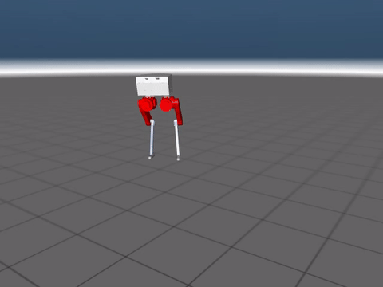

## Performance



## Install requirements

Tested on Python 3.12.

Create and activate a virtual environment at the repo root:

```
python3.12 -m venv .venv
source .venv/bin/activate   # Linux/macOS
```

You can also use conda to create the environment:

```
conda create -n biped-learning python=3.12
conda activate biped-learning
```

Install dependencies:

```
pip install -U pip
pip install -r requirements.txt
```

## Install the repo

With the venv activated:

```
pip install -e .
```

## Run biped learning code in Jax (Brax implementation of PPO)

```
cd src/jax
./train.sh
```

## Run biped learning code in Jax Simplified (PyTorch implementation of PPO)

```
cd src/jax_simplified
./run.sh
```

Enable Weights & Biases logging (optional):

(If you want to run on a specific gpu, set CUDA_VISIBLE_DEVICES and MUJOCO_EGL_DEVICE_ID to the desired GPU ID. You can check GPU IDs in the terminal via: ```nvidia-smi```)

```
cd robot_learning/src/jax_simplified
MUJOCO_GL=egl \
CUDA_VISIBLE_DEVICES=0 \
MUJOCO_EGL_DEVICE_ID=0 \
python skrl_ppo_pytorch.py \
  --train biped \
  --wandb \
  --video \
  --run-name run_name
```


## File structure

```
robot_learning
    └── src
            └── jax
                └── biped.py                   (Biped in Jax)
                └── train.py                   (Train PPO on Biped)
                └── test.ipynb                 (Jupyter notebook for testing)
                └── mjx_env.py                 (file taken from mujoco-playground and modified)
                └── wrapper.py                 (file taken from mujoco-playground and modified)
                └── randomize.py               (domain randomization)
                └── utils.py                   (utils)
            └── assets
                └── biped                      (biped)
            └── jax_simplified
                └── run.sh                   (run the code)
                └── skrl_ppo_pytorch.py      (PPO implementation in PyTorch)
                └── envs
                    └── biped.py             (Biped environment)
                └── utils.py                (utils)
```


This project uses/derives from MuJoCo Playground (Apache 2.0) by Google DeepMind.


# Run the robot with the keyboard


```
cd robot_learning/src/jax/envs
mjpython biped_test.py
```

Note: on MacOS you will likely need to whitelist both the terminal and the mjpython executable for input monitoring.
In System Settings, navigate to Privacy & Security -> Input Monitoring, then add your terminal and mjpython (cmd+shift+G in the file browser will let you add a path).
